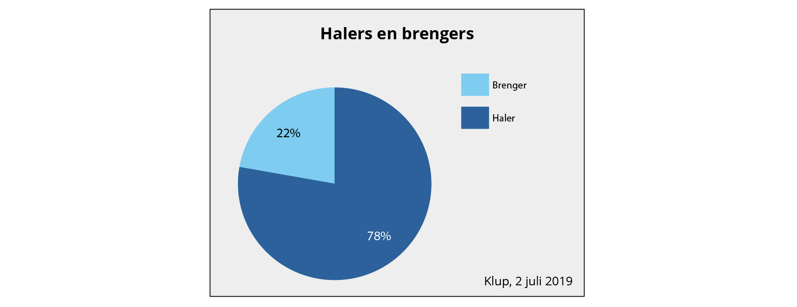
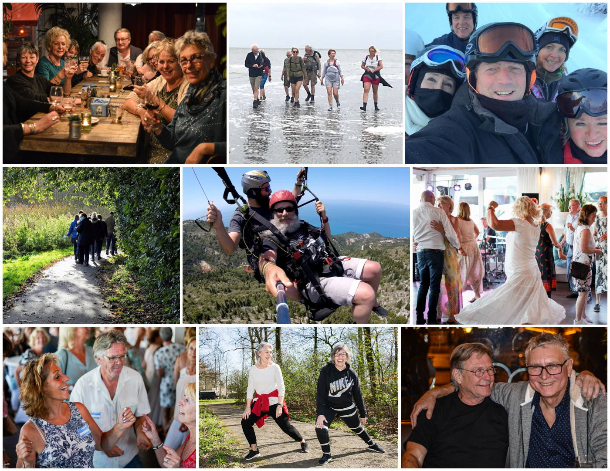
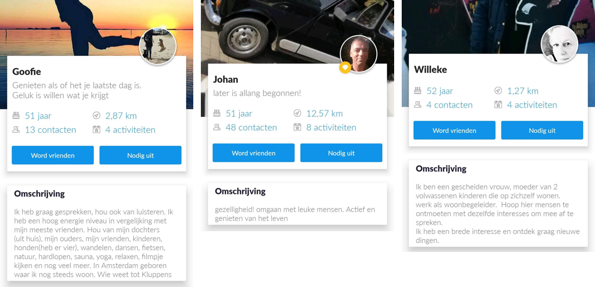

# De doelgroep

Klup richt zich op 50-plussers in Nederland. Om je aan te kunnen melden in de app, moet je dan ook 50 jaar of ouders zijn. De gebruikers van de Klup app worden **kluppers** genoemd. 

## De kluppers in cijfers

**Aantal gebruikers**  
Klup telt ruim 40.000 gebruikers, waarvan er ongeveer 10.000 per maand actief zijn \(dat wil zeggen dat ze minstens 1 keer de app gebruikt hebben in de laatste 30 dagen\). Gemiddeld opent 18% van de kluppers dagelijks de app.

**Geslacht & leeftijd**  
Als je kijkt naar onderstaande statistieken van de Klup app, is het grootste gedeelte van de kluppers \(ruim de helft\) tussen de 50 en de 60 jaar. Daarnaast is de ruime meerderheid vrouw \(bijna driekwart\).

**Aantal activiteiten**  
Per maand worden er gemiddeld 450 activiteiten aangemaakt, en er vinden ook gemiddeld 450 activiteiten per maand plaats. Dit komt neer op ruim 100 activiteiten per week. Er nemen in totaal gemiddeld 3500 kluppers per maand deel aan activiteiten.

**Halers & brengers**  
Klup maakt binnen de groep actieve gebruikers onderscheid tussen **halers** en **brengers**. Halers zijn kluppers die alleen deelnemen aan activiteiten. Brengers zijn kluppers die naast deelnemen, ook activiteiten organiseren. Het meerendeel van de kluppers neemt alleen deel aan activiteiten \(de halers\), namelijk 78%.

## Wie zijn de kluppers?

> _“Vijftigers en zestigers van nu voelen zich als dertigers met extra jaren ervaring op de teller. Ondanks een rug of knie die af en toe protesteert en een bloeddruk aan de hoge kant, staat hun geluksbarometer op mooi weer.”_   –   Filip Lemaitre, auteur The Silver Ones \(2018\)

Wekelijks gaan er honderden kluppers – zoals de gebruikers van de app worden genoemd – naar Klup activiteiten door heel Nederland. Uit gesprekken die Klup heeft gevoerd met gebruikers blijkt dat de kluppers opzoek zijn naar gezelligheid, contact, een nieuwe vriendengroep en \(weer\) actief willen zijn. In de praktijk zijn dit voornamelijk alleenstaanden. \(Klup, 2019\)

Klup helpt hen om ervoor te zorgen dat ze niet in het 'verdomhoekje' raken, zoals klupper Martin mooi verwoordde in de [focus group](https://ninavdberg92.gitbook.io/klup-redesign-productbiografie/onderzoek-en-inzichten/de-kluppers/focus-group) die ik heb gehouden.

> _“Mijn vrouw is laatst overleden. Ik heb me aangemeld bij Klup om aansluiting bij andere mensen te zoeken zodat ik niet in het 'verdomhoekje' raak.”_   –   Klupper Martin

De kluppers nemen deel aan allerlei soorten activiteiten. Van gezellig samen borrelen tot dansen op feestjes, van wandelen in het park om de hoek tot parachute springen in Griekenland. Maar één ding staat altijd vast: je doet het samen.

> _“Het hoogtepunt voor mij was “De Dijk” in november. En als slagroom op de taart was het feit dat alle Kluppers die aanwezig waren er onwijs van genoten en dat we dit gevoel samen deelden. Dat samen genieten geeft zo’n rijk gevoel!”_   – Klupper Arlinde

Als je de profiel omschrijvingen in de app en de blog berichten op de website leest, vallen er een aantal dingen op. De kluppers zijn positief ingesteld en genieten met volle teugen van het leven. Nu de kinderen de deur uit zijn hebben ze meer tijd om dingen voor zichzelf te doen. Ze hebben uiteenlopende interesses, zijn graag actief bezig en zijn op zoek naar gelijkgestemden. Ze vinden het gezellig om nieuwe mensen te ontmoeten en samen activiteiten te ondernemen.

## Persona's

De kluppers kun je opdelen in drie subgroepen: de fanatieke kluppers, de op-z'n-tijd kluppers en de organisatoren.



**Kenmerken**

* Neemt wekelijks of dagelijks deel aan activiteiten
* Kijkt elke dag in de Klup app om nieuwe activiteiten te checken
* Meld zich vaak ruim van te voren aan voor activiteiten
* Weet wat voor activiteiten er vaker terugkomen in de app en wie deze organiseren
* Kent veel andere kluppers en heeft een vriendengroep binnen Klup opgebouwd
* Vertelt aan anderen hoe leuk Klup is en probeert ze over te halen om ook te gaan kluppen
* Voelt zich met trots onderdeel van de Klup community

**Behoeften**

* Genoeg opties om de \(soort\) activiteiten die ze zoeken te kunnen vinden
* Makkelijk kunnen communiceren met andere kluppers via de app



**Kenmerken**

* Kijkt in de app naar aankomende activiteiten om in de nabije toekomst te gaan doen
* Heeft buiten de klup community om nog een druk \(sociaal\) leven
* Vergeet soms dat de Klup app bestaat
* Wil geen moeite moeten doen om lang te zoeken naar een leuke activiteit
* Vind het leuk om af en toe naar een Klup activiteit te gaan
* Heeft alleen oppervlakkig contact met andere kluppers en is niet op zoek naar diepgaande vriendschappen/relaties
* Voelt zich meer een buitenstaander dan onderdeel van de Klup community

**Behoeften**

* Dat de app de juiste activiteiten aan ze laat zien, zonder dat ze daar zelf moeite voor hoeven te doen
* Triggers vanuit de app zodat ze gemotiveerd worden om de app te gebruiken 



**Kenmerken**

* Stopt veel tijd in het organiseren van activiteiten
* Haalt energie en positiviteit uit het organiseren van activiteiten
* Is een echt mensen-mens, houdt van sociaal zijn en mensen helpen
* Helpt nieuwe kluppers op weg en betrekt ze bij de community
* Denkt mee met de organisatie van Klup voor verbeteringen
* Voelt zich met trots onderdeel van de Klup community

**Behoeften**

* Makkelijk in contact komen met \(nieuwe\) kluppers om ze uit te nodigen voor de georganiseerde activiteit
* Goed kunnen communiceren met de deelnemers bij het beantwoorden van vragen en brengen van mededelingen



