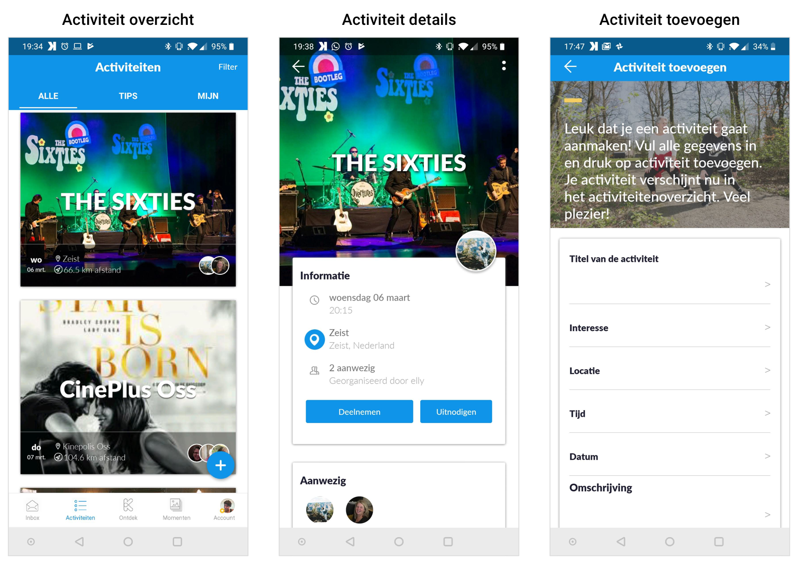
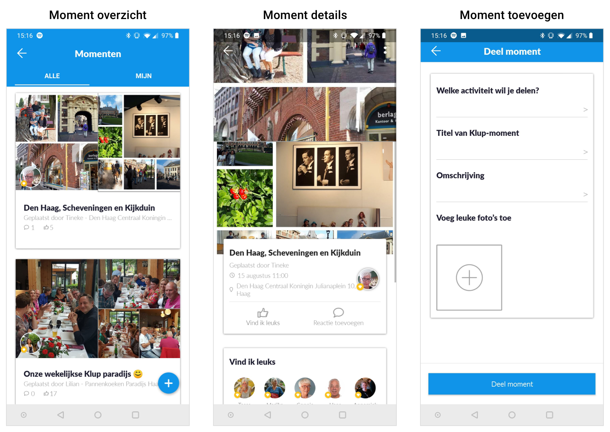
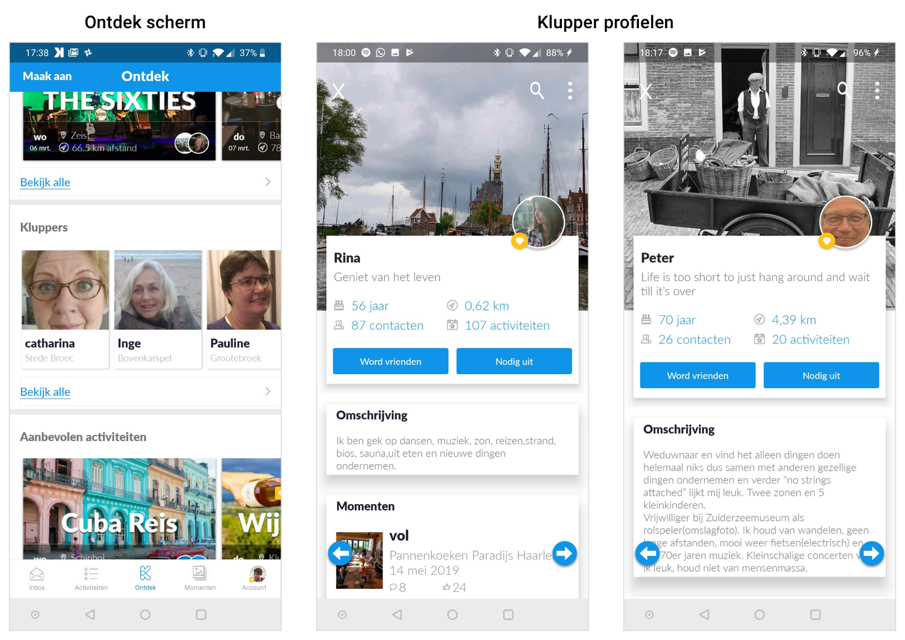
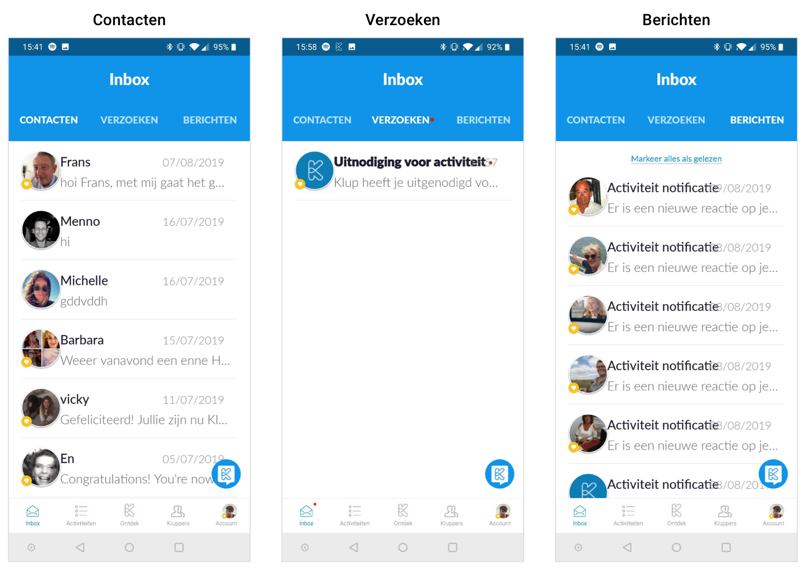

# De Klup app

De Klup app bestaat uit vijf hoofdonderdelen: Ontdek, activiteiten, momenten, kluppers en de inbox. Hieronder licht ik deze onderdelen toe zodat je als lezer een beeld hebt van hoe de huidige Klup app in elkaar zit.

## Ontdek scherm

Het ontdek scherm is het startscherm. Dit scherm bestaat uit zeven verschillende rijen content waar je horizontaal doorheen kunt scrollen. Zoals de naam al aangeeft, kun je hier activiteiten en kluppers "ontdekken", die je anders misschien zou missen wanneer je zelf zoekt.

Je vindt hier:

* Activiteiten speciaal voor jou \(afgestemd op je interesses\)
* Kluppers
* Aanbevolen activiteiten
* Aankomende activiteiten
* Laatst toegevoegde activiteiten
* Laatst toegevoegde momenten
* Laatste nieuws \(blog berichten\)

## Activiteiten

In het activiteiten overzicht kun je alle activiteiten vinden die in de app staan. Je kunt de activiteiten filteren \(op afstand en interesses\) en je kunt zelf een activiteit toevoegen. Onder het tabblad “mijn“ vind je de activiteiten waar je heen gaat en heen bent geweest. Het tabblad "tips" staat leeg en wordt niet meer gebruikt \(hier zette Klup zelf voorheen wel eens activiteiten in\).

Op het detail scherm vind je meer informatie over de activiteit en kun je je aanmelden. Ook kun je bevriende kluppers uitnodigen om deel te nemen aan de activiteit.

## Momenten

Momenten zijn een soort verslagjes van de activiteiten waar kluppers naar toe zijn geweest. Hieraan kun je foto's en een omschrijving toevoegen. Onder het tabblad "mijn" vind je je eigen momenten.

## Kluppers

In de app kun je de profielen van andere kluppers bekijken. Je kunt hier alleen komen vanaf het ontdek-scherm. Er is niet echt een overzicht, maar je kunt door de profielen heen gaan door naar links of rechts te swipen of op de pijltjes te tikken. Je kunt ook filteren \(op afstand, geslacht, leeftijd en interesses\) door op het vergrootglas te klikken. Je kunt andere kluppers een vriendschapsverzoek sturen en je kunt ze uitnodigen voor een activiteit waar je naar toe gaat.

## Inbox

De inbox bestaat uit drie tabbladen:

1. Contacten: je contacten waarmee je kunt chatten
2. Verzoeken: openstaande vriendschapsverzoeken en uitnodigingen voor activiteiten 
3. Berichten: meldingen over activiteiten \(reacties, wijzigingen, aanmeldingen etc.\)

Ook vind je hier rechtsonderin een blauwe button met het Klup logo. Als je daar op klikt, zie je alle berichten die Klup gestuurd heeft en je kunt zelf een bericht sturen naar Klup \(de hulp chat\).

