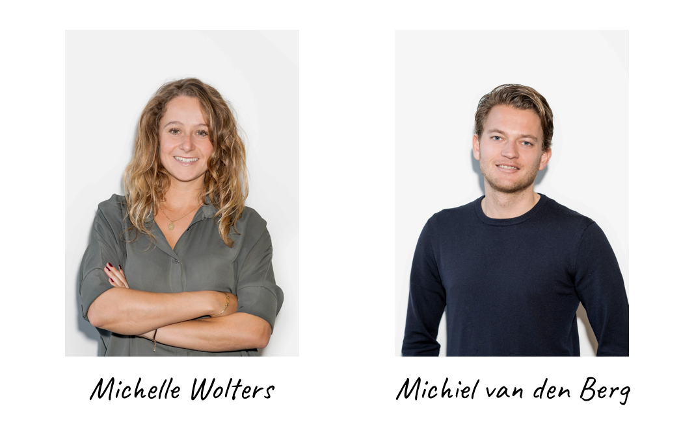

# Het verhaal achter Klup

Het bedrijf waarvoor ik mijn afstudeerproject uitvoer is Klup. Klup is een start-up in Amsterdam die 50-plussers samenbrengt door middel van een mobiele app. Klup is in 2016 opgericht door Michelle Wolters en Michiel van den Berg. Michelle is een aantal jaar geleden met haar vader en zussen verhuisd van Brabant naar Amsterdam nadat hun moeder is overleden. Haar vader kende helemaal niemand in de grote stad en vond het moeilijk om contact te maken en dingen te ondernemen met andere mensen. Toen begon het idee van Klup bij Michelle te borrelen. Samen met studiegenoot Michiel van den Berg heeft ze uiteindelijk de duik in het diepe genomen en is ze Klup gestart met als doel om 50-plussers met elkaar in contact te brengen om ervoor te zorgen dat ze niet vereenzamen.  

