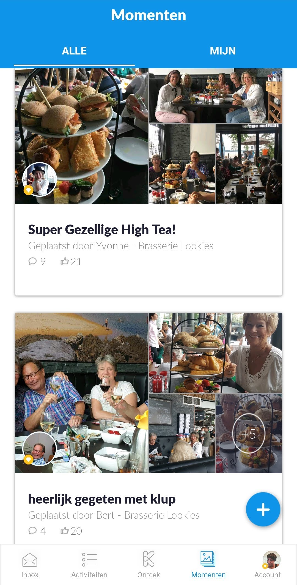

# Prototype 1.0

Vanuit mijn doelgroep onderzoek, analyse van de huidige app, deskresearch en meerdere iteratieronden ben ik uiteindelijk tot de oplossing gekomen van prototype 1.0. Hier laat ik de verschillende functies en flows zien en licht ik mijn belangrijkste ontwerpkeuzes toe.

## Het redesign



Het hoofdprobleem waar de huidige Klup app mee kampt, is dat de gebruikers veel moeite hebben met het navigeren door de app. Het gebruik van de bottom navigation en de schermen onderverdeeld in tabbladen zorgt ervoor dat de app te veel sublagen heeft en dat de gebruikers niet goed weten waar ze zich bevinden in de app.

In mijn herontwerp heb ik de bottom navigation weggehaald en vervangen door een startscherm met grote knoppen die leiden naar de zes hoofdonderdelen van de app. Wanneer de gebruiker aan het navigeren is in de app, staan er onderaan altijd twee of drie knoppen: een knop om direct terug te keren naar het startscherm, een terug knop om één scherm terug te gaan en \(indien van toepassing bij het scherm\) de belangrijkste actie van dat scherm.

Deze vorm van navigatie heb ik toegevoegd na de [testresultaten van prototype 0.2](https://ninavdberg92.gitbook.io/klup-redesign-productbiografie/het-redesign/prototype-0.2/test-+-resultaten#conclusies-and-inzichten). Ik heb toen onderzoek verricht naar [navigatie voor een oudere doelgroep](https://ninavdberg92.gitbook.io/klup-redesign-productbiografie/onderzoek-en-inzichten/een-applicatie-voor-50-plussers#simpele-and-consisitente-navigatie) en ben zo bij deze oplossing uitgekomen. Na alle testrondes die daarna volgden kan ik concluderen dat deze manier van navigeren goed werkt voor deze doelgroep.

### Prototype



## Functies en flows

In de linker tabbladen laat ik steeds de flows in mijn herontwerp zien, en in de rechter tabbladen kun je de flows van de huidige Klup app bekijken ter vergelijking.

NB. Van de huidige app heb ik niet alle flows door middel van een video registratie op kunnen nemen, dit komt omdat de Klup app ondertussen een update heeft gehad en hierdoor afwijkt van de versie waar ik vanaf het begin van mijn project vanuit ben gegaan en waar mijn onderzoek op is gebaseerd. Daarom gebruik ik in sommige gevallen screenshots om de flow weer te geven, aangezien ik die nog in mijn bezit heb van de vorige versie van de app.

### 1. Introductie





Wanneer de gebruiker de app op zijn telefoon heeft geïnstalleerd, krijgt hij eerst een korte introductie te zien waarin wordt uitgelegd wat Klup is. Dit doe ik door middel van een [intro tour](http://ui-patterns.com/patterns/Tour). Door de tone of voice die ik gebruik wil ik het gevoel creëeren dat de gebruiker zin krijgt om te gaan beginnen met kluppen. 





In de huidige app kun je een introductie video bekijken waarin Jaap \(community manager\) je welkom heet. Hij legt hij uit wie hij is en wenst je veel plezier bij de Klup activiteiten. Verder wordt er niet uitgelegd wat Klup is. In de [focus group](https://ninavdberg92.gitbook.io/klup-redesign-productbiografie/verkenning/de-kluppers/focus-group) komt naar voren dat hier wel behoefte aan is, zodat de gebruiker van te voren weet wat de bedoeling is van Klup. Deze video van Jaap zou nog wel toegevoegd kunnen worden aan mijn eerste intro scherm \(in plaats van de foto\), het geeft namelijk wel een fijn persoonlijk gevoel.



### 2. Startscherm & navigatie





Nadat de gebruiker zich heeft geregistreerd of heeft ingelogd, komt hij op het startscherm terecht. Op dit startscherm ziet de gebruiker meteen duidelijk welke onderdelen er in de app zitten. Wanneer de gebruiker op één van de knoppen klikt, gaat hij naar dat gedeelte toe. De gebruiker kan door de app navigeren door gebruik te maken van de navigatieknoppen onderin het scherm. Hierdoor kan hij altijd makkelijk teruggaan naar het startscherm. Ik ben op deze vorm van navigatie uitgekomen na aanleiding van mijn onderzoek over [navigatie voor een oudere doelgroep](https://ninavdberg92.gitbook.io/klup-redesign-productbiografie/onderzoek-en-inzichten/een-applicatie-voor-50-plussers#simpele-and-consisitente-navigatie).

Uit mijn testen met prototype 0.3 \(met [niet-kluppers](https://ninavdberg92.gitbook.io/klup-redesign-productbiografie/het-redesign/prototype-0.3/test-niet-kluppers-+-resultaten) en [kluppers](https://ninavdberg92.gitbook.io/klup-redesign-productbiografie/het-redesign/prototype-0.3/test-kluppers-+-resultaten)\) en de testen met [prototype 0.4](https://ninavdberg92.gitbook.io/klup-redesign-productbiografie/het-redesign/prototype-0.4/test-+-resultaten) is gebleken dat de doelgroep het startscherm en deze manier van navigeren erg prettig en makkelijk vind werken.





Het startscherm van de huidige app is het ontdek scherm. Dit scherm bevat veel verschillende soorten content waardoor het erg druk is. De problemen die bij dit scherm naar voren komen kun je lezen in de [analyse van het startscherm](https://ninavdberg92.gitbook.io/klup-redesign-productbiografie/verkenning/de-app/start-scherm). 



De gebuiker kan navigeren door middel van de bottom navigation onderin. De schermen inbox, activiteiten en momenten zijn onderverdeeld in tabbladen. De klupper profielen zitten niet in de bottom navigation maar zijn alleen te bereiken vanuit het ontdek scherm. In mijn [analyse van de navigatie](https://ninavdberg92.gitbook.io/klup-redesign-productbiografie/verkenning/de-app/navigatie) en [testen met de gebruikers](https://ninavdberg92.gitbook.io/klup-redesign-productbiografie/het-redesign/prototype-0.2/test-+-resultaten) is naar voren gekomen dat de navigatie erg verwarrend is en er voor zorgt dat de gebruikers verdwalen in de app.



### 3. Activiteiten scherm





In het activiteiten scherm kan de gebruiker meteen de nieuwste activiteiten vinden. [Van alle onderdelen in het huidige ontdek scherm kijken ze daar het meeste naar](https://ninavdberg92.gitbook.io/klup-redesign-productbiografie/het-redesign/prototype-0.3/test-kluppers-+-resultaten). Daaronder  staat een uitgelichte activiteit die door Klup zelf is georganiseerd. Daar weer onder staan kaartjes die leiden naar activiteiten van een bepaalde interesse.

Met deze pagina kan Klup zelf experimenteren wat voor soort content de kluppers wel en niet interessant vinden door middel van AB testing. Ik raad hierbij wel aan om niet te veel content erop te zetten zoals nu bij het ontdek scherm het geval is, omdat de gebruikers hierdoor te veel informatie binnen krijgen waardoor ze gestresst raken \(cognitive overload\). Er wordt dan door de gebruiker niet verder naar de content gekeken en hij klikt het daarom weg.



In de huidige app is er geen vergelijkbaar scherm.



### 4. Activiteiten filteren





De gebruiker kan de activiteiten filteren door middel van drie dropdown menu's. In de huidige app kan de gebruiker alleen filteren op locatie/afstand en interesses. Uit mijn [interviews](https://ninavdberg92.gitbook.io/klup-redesign-productbiografie/verkenning/de-kluppers/interviews) en [berichten van kluppers](https://ninavdberg92.gitbook.io/klup-redesign-productbiografie/verkenning/de-kluppers/klachten-van-kluppers) komt naar voren dat de gebruikers de optie missen om te kunnen filteren op datum. Deze opties heb ik toegevoegd.

Ik heb voor dropdown balkjes gekozen omdat dit zorgt voor een rustige en overzichtelijke weergave in het overzicht en de gebruiker weet meteen wat de filter opties zijn en welke er ingesteld staan. In [prototype 0.2](https://ninavdberg92.gitbook.io/klup-redesign-productbiografie/het-redesign/prototype-0.2) en [prototype 0.3](https://ninavdberg92.gitbook.io/klup-redesign-productbiografie/het-redesign/prototype-0.3) heb ik een slide over filter uitgeprobeerd maar hierbij werd het woord "filteren" niet goed begrepen. [De testpersonen van prototype 0.4](https://ninavdberg92.gitbook.io/klup-redesign-productbiografie/het-redesign/prototype-0.4/test-+-resultaten) vonden deze dropdown balkjes makkelijk werken.





De problemen die voorkomen bij het filteren van de activiteiten in de huidige app heb ik beschreven in [mijn analyse](https://ninavdberg92.gitbook.io/klup-redesign-productbiografie/verkenning/de-app/activiteiten-filteren). Het grootste probleem hierbij is dat je in het overzicht niet ziet welke filters er aan staan. Daarnaast weten sommige gebruikers niet dat je de activiteiten kunt filteren omdat het woord "filter" in de top bar over het hoofd wordt gezien.



### 5. Meldingen aanzetten volle activiteit





De gebruikers willen weten wanneer er een plekje vrij komt bij een volle activiteit waar ze naar toe willen. Daar is in de huidige app geen mogelijkheid voor, behalve het zelf in de gaten houden door de activiteit vaak te checken. Dit is een groot irritatiepunt van veel gebruikers dat wordt aangegeven in mijn [focus group](https://ninavdberg92.gitbook.io/klup-redesign-productbiografie/verkenning/de-kluppers/focus-group), [interviews](https://ninavdberg92.gitbook.io/klup-redesign-productbiografie/verkenning/de-kluppers/interviews), [berichten van kluppers](https://ninavdberg92.gitbook.io/klup-redesign-productbiografie/verkenning/de-kluppers/klachten-van-kluppers) en de [ambassadeurs bespreking](https://ninavdberg92.gitbook.io/klup-redesign-productbiografie/verkenning/de-kluppers/ambassadeurs-bespreking).

In mijn prototype kan de gebruiker hiervoor meldingen aanzetten door een toggle in de detail pagina van de activiteit te gebruiken. Wanneer iemand zich afmeld voor de activiteit ontvangt de gebruiker hierover een push melding zodat hij zich snel kan aanmelden voor de activiteit.




Het komt geregeld voor dat activiteiten vol zitten omdat het maximaal aantal deelnemers zich heeft aangemeld. Deelnemers kunnen zich ook weer afmelden wat betekend dat er dus weer een plekje vrij is voor een andere klupper. De gebruikers moeten zelf in de gaten houden of er een plekje vrijkomt en ervaren dit als erg vervelend. 



### 6. Aanmelden voor activiteit





Bij het aanmelden voor een activiteit, moet de gebruiker eerst bevestigen of hij zich echt wil aanmelden voor de activiteit. Dit is om te voorkomen dat de gebruiker meteen is aangemeld wanneer hij per ongeluk op de knop drukt. Na het aanmelden, is op de plaats van de aanmeld knop een knop gekomen om je af te melden. De activiteit kun je terugvinden in je Klup agenda. Vergeleken met de huidige app, heb ik vooral het design verbeterd zodat het visueel rustiger is.







### 7. Contacten uitnodigen voor activiteit





Wanneer de gebruiker zich heeft aangemeld voor een activiteit, kan hij zijn contacten hiervoor uitnodigen. Ik heb de werking hiervan hetzelfde gelaten als in de huidige app omdat de gebruikers hier hier geen problemen mee ervaren. Wel heb ik het design verbeterd en heb ik een paar handigheidjes toegevoegd zoals het kunnen zoeken op naam van je contacten en iedereen tegelijk kunnen selecteren. Bij het invoeren van het bericht heb ik er bijgezet dat het optioneel is. Dit is in de huidige app ook zo alleen staat dat er niet bij. Omdat ik gebruik maak van een [full screen dialog](https://material.io/design/components/dialogs.html#full-screen-dialog) is het tekstinvoerveld groot genoeg om je volledige bericht te lezen. In het huidige ontwerp kan de gebruiker maar één regel tekst lezen wat heel onhandig is.







### 8. Kluppers





De kluppers zijn te bereiken vanuit het startscherm. Op het eerste scherm staan bovenaan je zes laatst toegevoegde contacten. Als je op de knop "Alle contacten weergeven" klikt, kun je al je contacten bekijken. Vanuit dat overzicht kun je makkelijk een bericht sturen of een contact uitnodigen voor aan activiteit. Onder je contacten staan nieuwe kluppers en kluppers in de buurt.

Als je kluppers wilt zoeken kun je onderaan op "zoeken" klikken. Daar kun je de kluppers filteren op woonplaats, leeftijd, geslacht en interesses. Deze filters worden voornamelijk door organisatoren gebruikt om deelnemers te vinden voor hun activiteit \(zie [conclusies test prototype 0.3](https://ninavdberg92.gitbook.io/klup-redesign-productbiografie/het-redesign/prototype-0.3/test-kluppers-+-resultaten)\). In de [interviews](https://ninavdberg92.gitbook.io/klup-redesign-productbiografie/verkenning/de-kluppers/interviews) gaven de gebruikers aan dat ze graag kluppers op naam zouden willen kunnen zoeken, dus die optie heb ik toegevoegd.




In de huidige app kun je de klupper profielen alleen bereiken vanuit het ontdek scherm. Je kunrt door de profielen heen gaan door te swipen of op de pijltjes te klikken. Ook kun je de kluppers filteren door op het zoek icoon bovenaan te klikken, maar dit zie je snel over het hoofd door de foto's in de achtergrond. Daarbij wekt het de impressie dat je op die manier binnen iemands profiel kan zoeken omdat daar het icoon staat, en niet in een overzicht met zoekresultaten. 



### 9. Bericht sturen naar een klupper





Naar aanleiding van [mijn laatste testresultaten met prototype 0.4](https://ninavdberg92.gitbook.io/klup-redesign-productbiografie/het-redesign/prototype-0.4/test-+-resultaten#conclusies-and-inzichten) en de [feedback van het Klup team](https://ninavdberg92.gitbook.io/klup-redesign-productbiografie/het-redesign/prototype-0.4/feedback-van-klup-team), heb ervoor gekozen om de huidige "word vrienden" knop te vervangen door "voeg toe als contact", en daarnaast nog de optie aan te bieden om alleen een bericht naar een klupper te kunnen sturen zonder dat je contact bent van elkaar. 

Wanneer je iemand alleen een bericht wilt sturen \(bijv. omdat je afgesproken hebt om met elkaar mee te reizen naar een activiteit\), kun je dit doen door op "stuur bericht" te klikken. Het verstuurde bericht kun je terugvinden bij je chat berichten. Je bent op dit moment nog geen contact van elkaar, dus de klupper staat niet tussen je contacten lijst.

Wanneer je wel iemand aan je contactenlijst toe wilt voegen, omdat je die persoon al beter kent en je vaker samen naar activiteiten gaat, kun je klikken op "Voeg toe als contact". De persoon komt nu tussen je contacten te staan en je kunt deze persoon nu makkelijk uitnodigen voor een activiteit.




In de huidige app hebben de gebruikers de mogelijkheid om andere kluppers een vriendschapsverzoek te sturen. Wanneer de ander dit verzoek accepteerd, worden jullie toegevoegd aan elkaars contactenlijst. Als je contact bent van elkaar, kun je elkaar makkelijk uitnodigen voor activiteiten en je kunt met elkaar chatten.

Je kunt dus niet iemand een bericht sturen, zonder eerst een vriendschapsverzoek te versturen dat de ander moet accepteren. Dit zorgt bij de kluppers voor een drempel om contact te leggen. Ze vinden het gek om iemand een vriendschapsverzoek te sturen als ze elkaar \(bijna\) niet kennen.



### 10. Uitnodiging van klupper bekijken en accepteren





Om deze flow soepeler te laten verlopen dan de flow in de huidige app, heb ik de storende pop-up weggehaald die je verteld dat je een uitnodiging hebt gekregen. De gebruiker krijgt namelijk ook al een psuh notificatie en in mijn design ziet de gebruiker een rood bolletje staan bij de meldingen in het startscherm. Wanneer je op het verzoek klikt, krijg je de activiteit te zien waarvoor je bent uitgenodigd met het het bericht erbij. Als de verzender geen bericht erbij heeft gezet, staat er alleen "&lt;naam klupper&gt; heeft je uitgenodigd". Vervolgens kun je de uitnodiging afwijzen of je kunt deelnemen aan de activiteit.





Wanneer iemand je een uitnodiging stuurt voor een activiteit, krijg je ongeacht waar je mee bezig bent in de app een grote pop-up in beeld wat vervelend is. De uitnodiging kun je terugvinden in de inbox onder het tabblad "verzoeken". Als je op het verzoek klikt kun je de uitnodiging lezen. Bij de uitnodiging wordt een standaard tekst gebruikt. Als degene die jou uitnodigt zelf een bericht heeft getypt, komt dit daar tussen te staan, waardoor je een vreemd lopend bericht krijgt.



### 11. Momenten bekijken





Wanneer een klupper bij een activiteit is geweest, kan hij hiervan een moment aanmaken met foto's en een tekst. Dit kunnen de andere kluppers bekijken, en ze kunnen het moment liken en erop reageren.  

De kluppers in mijn [interviews](https://ninavdberg92.gitbook.io/klup-redesign-productbiografie/verkenning/de-kluppers/interviews) gaven aan dat ze bij de momenten willen zien bij welke activiteit het moment hoort en wanneer het is geweest. Deze informatie heb ik toegevoegd aan de momenten kaartjes. 

Om het voor de gebruiker makkelijk te maken om momenten te vinden van activiteiten waar hij zelf bij is geweest, heb ik bovenaan het overzicht een toggle gezet waarmee de gebruiker kan wisselen tussen het overzicht met alle momenten en een overzicht met alleen de momenten waar hij zelf bij is geweest. 




In de huidige app kan de gebruiker de momenten op geen enkele manier filteren. Wanneer de gebruiker naar een activiteit is geweest en wil kijken of een andere deelnemer hier een moment van heeft aangemaakt, zit er niks anders op dan het overzicht door te scrollen. De titel van de activiteit en de datum staan er niet bij, dus dat maakt het zoeken extra lastig



