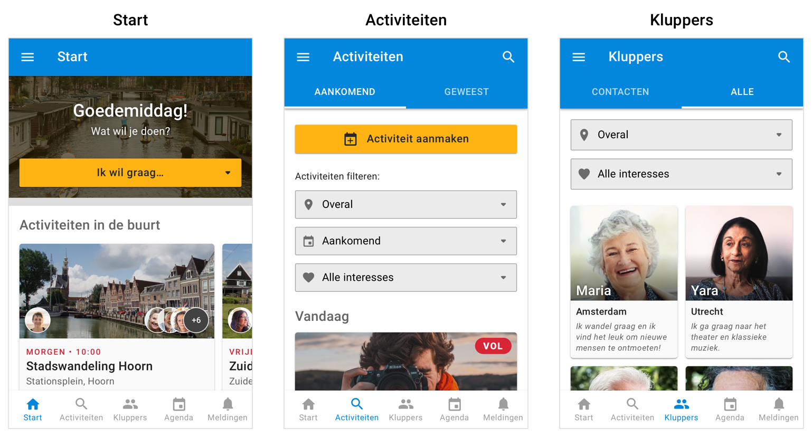
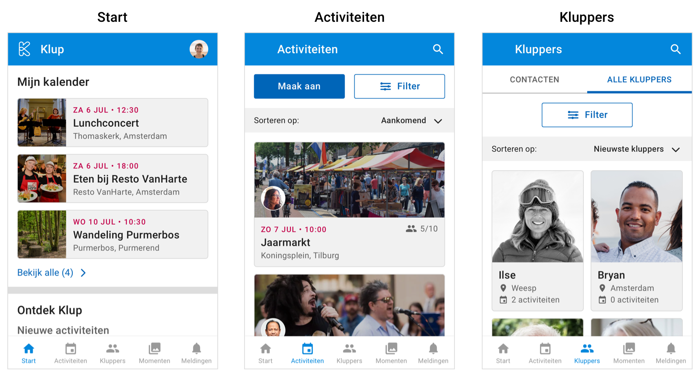
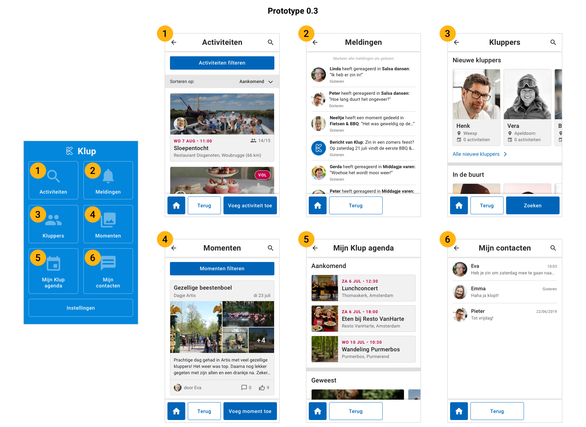
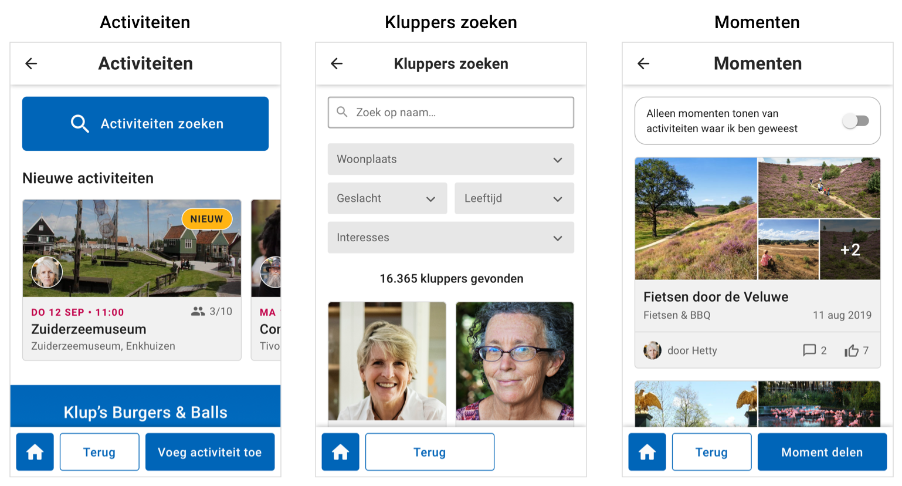

# Iteratieronden

NB. Alle prototypes zijn gemaakt voor het schermformaat van een Nexus 5X die ik gebruikte tijdens het testen. Wanneer je de prototypes in Marvel bekijkt, lopen sommige schermen daardoor niet helemaal door tot op de bodem.

## Prototype 0.1



In mijn eerste prototype heb ik mij gericht op het herontwerpen van de activiteiten en het kluppers gedeelte, omdat dit de twee belangrijkste onderdelen zijn van de app. Mijn doelen hierbij zijn:

1. Het design verbeteren zodat het er rustiger uitziet dan in de huidige app. Hierbij neem ik de punten mee die naar voren zijn gekomen uit mijn onderzoek naar [app interfaces voor een oudere doelgroep](../onderzoeksresultaten/een-app-voor-een-oudere-doelgroep.md).
2. Het filteren van de activiteiten verbeteren. Hierbij neem ik de punten mee die naar voren gekomen zijn uit mijn onderzoek naar [content filteren.](../onderzoeksresultaten/de-juiste-activiteiten-vinden.md)
3. Het aanpassen van het kluppers gedeelte zodat gebruikers een beter overzicht hebben van de profielen in de app.

### Ontwerp

[Klik hier voor een gedetailleerde omschrijving van prototype 0.1 en de vergelijking met de huidige app](https://ninavdberg92.gitbook.io/klup-redesign-productbiografie/het-redesign/prototype-0.1)

### Inzichten na testronde

[Klik hier voor alle testresultaten van prototype 0.1](https://ninavdberg92.gitbook.io/klup-redesign-productbiografie/het-redesign/prototype-0.1/test-+-resultaten)

* De interface is nog te druk waardoor de gebruikers niet goed weten waar ze op moeten klikken
* Voor het volgende prototype moet ik meer flows uitwerken zodat ik meer feedback kan verzamelen

## Prototype 0.2 



### Aanpassingen ontwerp

[Klik hier voor een gedetailleerde beschrijving van prototype 0.2 en de aanpassingen t.o.v. het vorige protoype](https://ninavdberg92.gitbook.io/klup-redesign-productbiografie/het-redesign/prototype-0.2)

* Nieuw design tabbladen
* Nieuw design activity cards
* Nieuwe manier van filteren
* Startscherm gepersonaliseerder

### Inzichten na testronde

[Klik hier voor alle testresultaten van prototype 0.2](https://ninavdberg92.gitbook.io/klup-redesign-productbiografie/het-redesign/prototype-0.2/test-+-resultaten)

* Gebruikers hebben veel moeite met navigeren door de app
* Het design werd als mooi en een stuk rustiger ervaren dan de huidige app

## Prototype 0.3



### Aanpassingen ontwerp

[Klik hier voor een gedetailleerde beschrijving van prototype 0.3 en de aanpassingen t.o.v. het vorige protoype](https://ninavdberg92.gitbook.io/klup-redesign-productbiografie/het-redesign/prototype-0.3)

* Toevoeging van startscherm en compleet andere manier van navigeren
* Uitwerking van momenten, meldingen, contacten en klupper detail scherm

### Inzichten na testronde

**Test met niet-kluppers**

[Klik hier voor alle testresultaten van prototype 0.3 met niet-kluppers](https://ninavdberg92.gitbook.io/klup-redesign-productbiografie/het-redesign/prototype-0.3/test-niet-kluppers-+-resultaten)

* Filteren gaat niet soepel
* Pop-up na bericht sturen klupper zorgt voor verwarring
* Navigeren gaat makkelijk

**Test met kluppers**

[Klik hier voor alle testresultaten van prototype 0.3 met kluppers](https://ninavdberg92.gitbook.io/klup-redesign-productbiografie/het-redesign/prototype-0.3/test-kluppers-+-resultaten)

* Nieuwe activiteiten het meest interessant om te zien
* Behoefte om kluppers te kunnen filteren
* Navigeren gaat makkelijk, design overzichtelijk

**Feedback van opdrachtgevers**

[Klik hier voor alle feedback van opdrachtgevers op prototype 0.3](https://ninavdberg92.gitbook.io/klup-redesign-productbiografie/het-redesign/prototype-0.3/feedback-van-opdrachtgevers)

* Zoekicoon vervangen door zoekbalk
* Bevestiging vragen na aanmelden activiteit
* Filteropties toevoegen bij kluppers: geslacht, leeftijd, locatie en interesses
* Kunnen uitnodigen van kluppers via profiel

## Prototype 0.4



### Aanpassingen ontwerp

[Klik hier voor een gedetailleerde beschrijving van prototype 0.4 en de aanpassingen t.o.v. het vorige protoype](https://ninavdberg92.gitbook.io/klup-redesign-productbiografie/het-redesign/prototype-0.4)

* "ontdek scherm" voor activiteiten toegevoegd \(nieuwe activiteite, uitgelicht, ...\)
* "ontdek scherm" voor kluppers toegevoegd \(nieuwe kluppers, in de buurt, ...\)
* Nieuwe manier van filteren
* Design momenten scherm aangepast

### Inzichten na testronde

**Test met kluppers**

[Klik hier voor alle testresultaten van prototype 0.4 met kluppers](https://ninavdberg92.gitbook.io/klup-redesign-productbiografie/het-redesign/prototype-0.4/test-+-resultaten)

* Gebruikers begrijpen direct het filtersysteem
* Bericht typen bij uitnodigen kluppers wordt over het hoofd gezien
* Voor gebruikers niet duidelijk en niet logisch dat wanneer je een bericht stuurt naar een klupper, dat diegene dan meteen toegevoegd wordt aan je contacten

**Feedback van Klup team**

[Klik hier voor alle feedback van opdrachtgevers op prototype 0.4](https://ninavdberg92.gitbook.io/klup-redesign-productbiografie/het-redesign/prototype-0.4/feedback-van-klup-team)

* Team blij met redesign
* Bericht sturen naar andere klupper en dan automatisch toevoegen als contact niet handig
* Zoekbalk verplaatsen naar top bar

