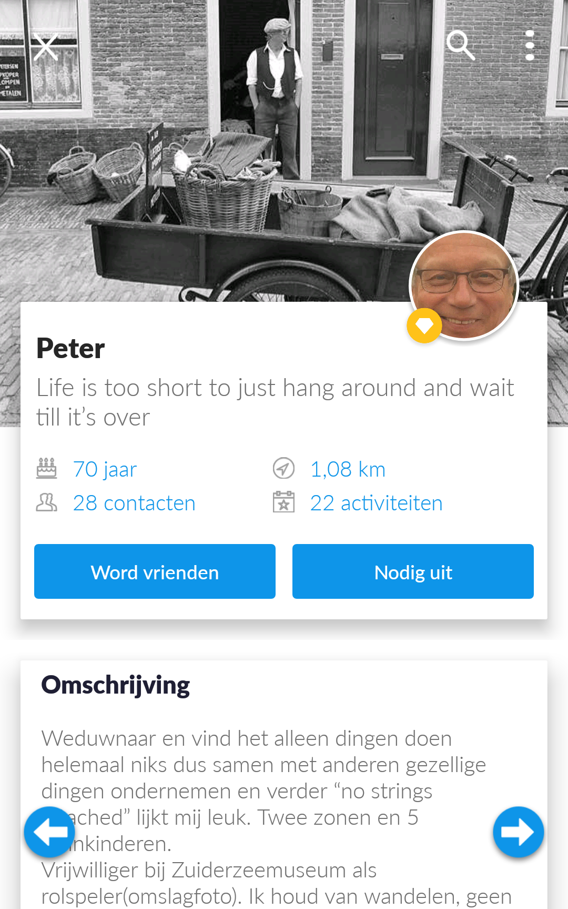

# App analyse

Als eerste stap in het verkennen van de problemen die voorkomen in de Klup app, heb ik zelf de hele app doorgenomen. Aan de hand van mijn eigen kennis en inzichten over app design, heb ik alle problemen die mij opvielen in kaart gebracht. 

## Startscherm

* Te veel content, te onrustig
* Allerlei soorten content door elkaar
* Niet goed afgestemd op gebruiker

[Klik hier voor de uitgebreidere probleemomschrijving over het start scherm](https://ninavdberg92.gitbook.io/klup-redesign-productbiografie/verkenning/de-app/start-scherm)

## Navigatie

* Relatie tussen bottom navigation en tabbladen verwarrend
* Schermen visueel te veel gelijk waardoor je niet goed weet op welk scherm je zit

[Klik hier voor de uitgebreidere probleemomschrijving over de navigatie](https://ninavdberg92.gitbook.io/klup-redesign-productbiografie/verkenning/de-app/navigatie)

## Design

* Algehele design druk en rommelig
* Inconsistent design
* Veel teksten klein en weinig contrast \(vooral voor deze doelgroep\)

[Klik hier voor de uitgebreidere probleemomschrijving over het design](https://ninavdberg92.gitbook.io/klup-redesign-productbiografie/verkenning/de-app/design)

## Activiteiten overzicht

* Tekst op foto's slecht leesbaar
* Tekst datum en locatie erg klein en dun
* Hoogte foto neemt meer ruimte in beslag dan nodig
* Locatie vaak nikszeggend \(naam van een restaurant, straatnaam etc.\)

[Klik hier voor de uitgebreidere probleemomschrijving over het activiteiten overzicht](https://ninavdberg92.gitbook.io/klup-redesign-productbiografie/verkenning/de-app/activiteiten-overzicht)

## Actifiteiten filteren

* Filter knop wordt over het hoofd gezien
* In het overzicht zie je niet welke filters er aan staan
* Aantonen actieve filter niet duidelijk genoeg voor doelgroep

[Klik hier voor de uitgebreidere probleemomschrijving over activiteiten filteren](https://ninavdberg92.gitbook.io/klup-redesign-productbiografie/verkenning/de-app/activiteiten-filteren)

## Activiteit details

* Sommige teksten slecht leesbaar \(te klein, te dun, te weinig contrast\)
* Niet mogelijk om eindtijd aan te geven

[Klik hier voor de uitgebreidere probleemomschrijvin over de activiteit details](https://ninavdberg92.gitbook.io/klup-redesign-productbiografie/verkenning/de-app/activiteit-details)

## Reacties bij activiteiten

* Antwoorden op een specifieke reactie niet mogelijk
* Geen één op één communicatie mogelijk
* Te veel meldingen in inbox over nieuwe reacties

[Klik hier voor de uitgebreidere probleemomschrijving over de reacties bij activiteiten](https://ninavdberg92.gitbook.io/klup-redesign-productbiografie/verkenning/de-app/reacties-bij-activiteiten)

## Activiteit annuleren

* Met annuleren wordt meteen de hele activiteit verwijderd

[Klik hier voor de uitgebreidere probleemomschrijving over activiteiten annuleren](https://ninavdberg92.gitbook.io/klup-redesign-productbiografie/verkenning/de-app/activiteit-annuleren)

## Klupper profielen

* Geen overzicht met kluppers, swipen door profielen
* Alleen te bereiken via ontdekscherm, niet in hoofdnavigatie
* Filtermogelijkheden weggestopt

[Klik hier voor de uitgebreidere probleemomschrijving over de klupper profielen](https://ninavdberg92.gitbook.io/klup-redesign-productbiografie/verkenning/de-app/klupper-profielen)

## Momenten

* Titel en datum van activiteit mist
* Momenten van verschillende activiteiten staan "door elkaar"
* Geen enkele zoek of filter mogelijkheid

[Klik hier voor de uitgebreidere probleemomschrijving over de momenten](https://ninavdberg92.gitbook.io/klup-redesign-productbiografie/verkenning/de-app/momenten)

## Inbox

* Omschrijving van meldingen geven te weinig over de inhoud weer
* Meldingen leiden niet naar juiste reactie

[Klik hier voor de uitgebreidere probleemomschrijving over de inbox](https://ninavdberg92.gitbook.io/klup-redesign-productbiografie/verkenning/de-app/inbox)

